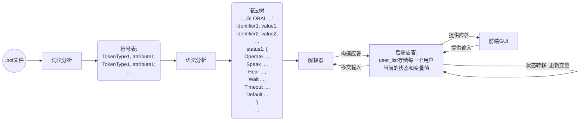

# DSLBot开发文档


本项目共分为词法分析、语法分析、解释器、后端应答、前端GUI，共5个模块。前四个模块在后端实现，最后一个模块在前端实现。他们之间的运作关系如下所示：



## 词法分析模块

- 文件路径：`server/bot/lexer.py`

### 数据结构

| 变量名           | 变量类型               | 描述                             |
|---------------|--------------------|--------------------------------|
| `keyword_str` | `list`             | 其中存储着所有的关键字字符串，用于在进行词法分析时匹配关键字 |
| `LexError`    | `class(Exception)` | 用于报出词法分析阶段的错误                  |
| `TokenType`   | `class(IntEnum)`   | 用于描述记号类型的枚举类                   |

### API

#### 类：Token

> 一个记号是一个形如<属性，属性值>的二元组。Token类是一个用于描述记号的二元组。

##### 实例属性

- `Token._type: TokenType`

  用于描述一个记号的属性

- `Token._attr: str`

  用于描述一个记号的属性值

##### 实例方法

- `Token.__init__(self, type: TokenType = TokenType.Error, attr: str = "") -> None`

  `Token`类的构造函数。

- `Token.__str__(self) -> str`

  `Token`类转换成字符串类型的类型转换函数。为了在调试和测试的时候方便输出，通过这个函数，可以直接使用`str(Token)`来打印一个记号的属性和属性值。

#### 类：Lexer

> 词法分析器，从文件输入字符流，分析这些字符，并生成一个记号流

##### 实例属性

- `Lexer.token_list: list[Token]`

  用于保存输出的记号流。

- `Lexer.input: IO`。

  输入文件的输入流。

##### 实例方法

- `Lexer.__init__(self, filePath: str) -> None`

  `Lexer`类的构造函数，会将`filePath`路径下的文件打开作为输入文件的输入流。

- `Lexer.lex() -> list[Token]`

  词法分析函数，根据每个由空格分割开的单词的模式决定他们是什么类型的记号，记录他们的属性和属性值并保存到`Lexer.token_list`中，最后进行返回。

  可能会抛出的异常有：

  - LexError: Unclosed string constant ——未闭合的字符串
  - LexError: Unclosed identifier —— 未闭合的标识符
  - LexError: Unexpected word %buf[i]% —— 不合法的单词

- `Lexer.show_list() -> None`

  打印输出保存好的记号流，调试测试时使用。

## 语法分析模块

- 文件路径：`server/bot/parser.py`

### 数据结构

| 变量名       | 变量类型           | 描述                       |
| ------------ | ------------------ | -------------------------- |
| `ParseError` | `class(Exception)` | 用于报出词法分析阶段的错误 |
| `WaitType`   | `class(IntEnum)`   | 用于描述等待的类型         |

### API

#### 类：Parser

> 语法分析器，输入记号流，分析记号流，并生成一个语法树

##### 实例属性

- `Parser.current_status: str`

  当前正在处理的状态名，初始为`""`。

- `Parser.idx: Int`

  这是一个在输入的记号流中的索引，代表当前处理到的位置。

- `Parser._token_list: list[Token]`

  输入的记号流。


- `Parser.has_main: bool`

  当前已解析的状态中是否含有`main`状态。

- `Parser.tree: dict`

  生成的语法树，具体结构如下：

  ```json
  {
    "__GLOBAL__": {
      "%id1%": value1,
      "%id2%": value2,
      ...
    },
    status1_name: {
      "Speak": "Speak something",
      "Wait": 5,
      "Hear": {
        "regex1": hear1_status,
        "regex2": hear2_status,
        ...
      },
      "Default": default_status,
      "Timeout": timeout_status,
      "Operate": {
        "%id1%": value1,
      	"%id2%": value2,
      	...
      }
    }
  }
  ```


##### 实例方法

- `Parser.__init__(self, token_list: list[Token]) -> None`

  `Parser`类的构造函数，请注意其中对于`Parser.tree`的初始化。

  ```python
  def __init__(self, token_list: list[Token]) -> None:
          self.current_status = ""
          self.idx = 0
          self._token_list = token_list
          self.tree = {
              "main":{
                  "Speak": "",
                  "Wait": WaitType.Forever,
                  "Hear": {},
                  "Default": "",
                  "Timeout": "",
                  "Operate":{}
              }
          }
  ```
  
  在初始化`Parser.tree`时，会先自动把main状态添加进来，尽管此时还没有确定用户是否真的编写了`main`状态，但是这有利于稍后处理全局变量。在解析完所有的状态之后会进行一次检查，如果用户真的没有定义`main`状态，则会在语法分析的结束阶段抛出异常。
  
- `Parser.parse(self) -> dict`

  这个函数会不断的根据目前读到的关键字或者标识符选择相应的语法分析方案进行分析。在每次解析完成一个状态后，都会进行一次检查，检查这个刚刚完成解析的状态里的语句是否合法。在所有符号都解析完毕之后，会最后检查一下用户有没有编写`main`状态，然后返回生成的语法树。

  可能会抛出的异常有：

  - ParseError: Expected a keyword or an identifier —— 当语法分析器期望一个关键字或者标识符的时候却接收到了其他输入。
  - ParseError: No main status to begin with —— 没有起始状态`main`

- `Parser.parse_status(self) -> None`

  这个函数是语法分析器读取到关键字Status时采取的行为。它会首先检查上一个状态是否合法，然后开始在语法树中为接下来要创建的新状态建立新的字典。

  可能会抛出的异常有：

  - ParseError: Expected a Status name —— Status关键字之后紧跟着的不是一个状态名
  - ParseError: Duplicate Status name:  %self._token_list[self.idx]._attr% —— 重复的状态名

- `Parser.parse_speak(self)`

  这个函数是语法分析器读取到关键字Speak时采取的行为。它会把该条Speak语句的内容插入到当前状态的语法树中。

  可能会抛出的异常有：

  - ParseError: Expected a string constant —— Speak关键字之后紧跟着的不是一个字符串常量

- `Parser.parse_hear(self)`

  这个函数是语法分析器读取到关键字Hear时采取的行为。它会把该条Hear语句中对应的正则表达式和转移状态插入到当前状态的语法树中。

  可能会抛出的异常有：

  - ParseError: Expected a string constant —— Hear关键字之后紧跟着的不是一个字符串常量（正则表达式）
  - ParseError: Expected a status to transfer —— 正则表达式之后紧跟着的不是一个状态名

- `Parser.parse_wait(self)`

  这个函数是语法分析器读取到关键字Wait时采取的行为。它会把该条Wait语句中对应的等待时间和转移状态插入到当前状态的语法树中。

  可能会抛出的异常有：

  - ParseError: Expected a wait time —— Wait关键字之后紧跟着的不是一个数字常量
  - ParseError: Wait time can only be an integer greater than 0. —— 等待时间不是一个正整数

- `Parser.parse_default(self)`

  这个函数是语法分析器读取到关键字Default时采取的行为。它会把该条Default语句中对应的转移状态插入到当前状态的语法树中。

  可能会抛出的异常有：

  - ParseError:  Expected a Status name —— Default关键字之后紧跟着的不是一个状态名

- `Parser.parse_timeout(self)`

  这个函数是语法分析器读取到关键字Timeout时采取的行为。它会把该条Timeout语句中对应的转移状态插入到当前状态的语法树中。

  可能会抛出的异常有：

  - ParseError:  Expected a Status name —— Timeout关键字之后紧跟着的不是一个状态名

- `Parser.parse_variable(self)`

  这个函数是语法分析器读取到一个标识符时采取的行为。它会把该标识符的赋值语句插入到当前状态的语法树中。注意：如果仅仅出现了一个标识符，而没有出现相应的赋值语句，则这个标识符不会产生任何效果。

  可能会抛出的异常有：

  - ParseError:  Expected a number or string constant —— 赋值语句的右值不是一个数字或字符串常量

- `Parser.status_check(self) -> None`

  该函数在每次解析完一个状态，开始解析下一个状态之前，对刚刚解析的状态进行一次检查。并且记录`main`状态是否出现。

  可能会产生的警告有：

  - UserWarning: Status  %self.current_status% has to wait forever before goto the timeout status. —— 当一个状态中只有Timeout语句，却没有Wait语句
  - UserWarning: Status %self.current_status % has nothing to speak. —— 当一状态中没有Speak语句

  可能会抛出的异常有：

  - ParseError: Status %self.current_status% has a valid wait time but no Timeout status set. —— 当一个状态中只有Wait语句，却没有Timeout语句

## 解释器模块

- 文件路径：`server/bot/interpreter.py`

### 数据结构

| 变量名         | 变量类型           | 描述                       |
| -------------- | ------------------ | -------------------------- |
| `RuntimeError` | `class(Exception)` | 用于报出解释执行阶段的错误 |

### API

#### 类：Robot

> 用于处理每个用户的状态转移，改变变量的值并返回要回复用户的新状态，新的等待时间，新的回复消息和新的变量的值

##### 实例属性

- `Robot.tree: dict`

  来自语法分析阶段的语法树，是机器行为的依据。

##### 实例方法

- `Robot.__init__(self, tree: dict) -> None`

  `Robot`类的构造函数。

- `Robot.handle_message(self, status: str, message: str) -> dict`

  处理机器人应答的核心逻辑，其中`status`是客户端当前的状态，`message`是用户输入的字符串。

  在接收到一条消息之后机器人要做出如下的一系列的动作：

  2. 决定要转移到哪个状态

  3. 告知客户端转移到**新**的状态之后的行为，即：

     1. 为变量赋值

     2. 返回要应答的消息

     3. 启动Wait计时器。

  之所以要强调“新”，是因为并不是所有的消息都会引起状态的转移。比如在一个没有设定Default转移的状态下，输入一个不被任何Hear语句接受的消息，此时自动机的状态不会发生变化。但是尽管在这种情况下自动机的状态不会转移，依然会刷新一次Wait计时器。同时，这也揭示了一个状态有Default语句，但是Default转移是自身和根本没有Default语句的区别。如果是前者，依然会执行以上完整的三步；如果是后者，只会执行第3步，刷新Wait计时器。

  在决定要转移到哪个状态时，机器人会先判断这条消息是不是一条超时消息，如果是超时消息，则会直接转移到Timeout定义的状态；如果不是超时消息，则会依次尝试将`message`与Hear语句定义的正则表达式进行匹配，如果有匹配的正则表达式，则直接转移到对应的状态，如果没有，则直接转移到Default状态，如果当前状态没有定义Default状态，则不会进行状态转移。

  在进行完状态转移后，会先依照语法树中新状态定义的赋值语句决定为变量赋什么值，然后返回新状态和新状态中Speak语句中的字符串和新状态的计时器。

  可能会抛出的异常有：
  
  - RuntimeError: Undefined status: %next_status% —— 当要转移到一个未定义的状态时


## 后端应答模块

- 文件路径：`server/main.py`

### 数据结构

| 变量名      | 变量类型 | 描述               |
| ----------- | -------- | ------------------ |
| `file_path` | `str`    | 读入脚本文件的路径 |
| `key`       | `str`    | 加密用户消息的密钥 |

### API

- ```python
  @app.get("/dsl")
  def give_response(status: str, message: str):
      return robot.handle_message(status, message)
  ```

  后端需要做的唯一一件事情就是响应客户端的查询请求。来自客户端的查询参数有两个：

  1. 客户端当前的状态
  2. 用户的输入

  比如客户端在状态为`main`时接收到了字符串`'abbc'`则会向向服务端发送一条这样的GET请求。

  ```
  GET /dsl?status=main&message=abbc
  ```

  然后服务端会为客户端提供：

  1. 一个新的状态
  2. 到达新的状态要等待的时间
  3. 到达新的状态要打印的字符串
  4. 到达新的状态需要对哪些状态赋值

  比如对于上述例子，服务端可能会返回这样的内容：

  ```json
  {
      "status": "main",
      "wait": 5,
      "message": "What can I help you, %name%?",
      "var": {
          "%name%": "He Jiahao",
          "%num%": "0"
      }
  }
  ```

  

## 前端GUI模块

前端GUI是由一个React组件实现的，它的核心在`client/DSLbot.jsx`。在该文件中定义了一个React组件叫做DSLBot，这个组件在平常只是以一个客服标志普通的悬浮在页面上，如下图所示：


当用户单击这个按钮之后，便会打开一个与机器人的聊天窗口，如下图所示：


用户便可以通过这个窗口与客服机器人进行对话。

下面详细阐述该组件的实现方式。

### 渲染函数

在渲染函数中返回的jsx对象的大体结构如下所示，先将渲染函数呈现出来有助于了解前端的整体架构。

```jsx
<Button onclick={() => this.handleClick()}>
  {/*该部分是页面上的悬浮按钮*/}
</Button>
<Modal
  {/*该部分是对话框*/}
  open={this.state.modalOpen}
  onCancel = {() => this.setState({modalOpen: false})}
  footer={
    {/*对话框的脚部是一个输入框*/}
      <Input 
           onPressEnter={() => this.handleEnter()}
           onChange={this.keyUp}
           value={this.state.inputValue}
           ></Input>
    }>
  {/*对话框的内容是一个列表*/}
  <List>
    {/*实时呈现this.state.msgList中的内容，通过this.handleResponse()函数更新*/}
  </List>
</Modal>
```

### state变量

下面介绍需要实时渲染的state变量：

| 变量名       | 变量类型                                   | 描述                                                         |
| ------------ | ------------------------------------------ | ------------------------------------------------------------ |
| `modalOpen`  | `boolean`                                  | 用于记录当前对话框是否处于打开状态。                         |
| `msgList`    | `list[{isUser: boolean, content: string}]` | 用于记录对话框中的消息，isUser用于标注该消息是否为用户所发送的消息，content为消息内容。 |
| `inputValue` | `string`                                   | 用于实时记录输入框中的内容                                   |
| `status`     | `string`                                   | 当前客户端所处的状态                                         |
| `varList`    | `object`                                   | 用于存储用户的变量和值                                       |
| `timerID`    | `int`                                      | 当前超时计时器的编号                                         |

### API

- `handleResponse = (response) => {...}`

  `handleResponse`是一个非常重要的回调函数，在之后的函数中会使用到它，所以先进行介绍。`handleResponse`会解析`response`中的各个字段，并执行相应的操作。它的具体做法是，在500ms的延迟（为了让机器人的回复显得更自然）后：

  1. 将`response.data.var`中的每一个变量的新值存储到`this.varList`里
  2. 将`response.data.status`中的新状态存储到`this.status`里
  3. 将`response.data.message`字符串中的标识符先用相应的值进行替代，然后将生成的字符串添加到`this.state.msgList`中
  4. 按照`response.data.wait`中的内容设置计时器，在计时器触发后，发送超时信息
  
  ```jsx
  handleResponse = (response) => {
          setTimeout(() => {  // 设置500ms的延迟，让机器人回复自然一些
              let newVarList = this.state.varList
              for (let k in response.data.var){
                  newVarList[k] = response.data.var[k]
              }
              console.log(response.data)
              this.setState({
                  status: response.data.status,
                  varList: newVarList
              })
              if (response.data.message) {
                  let mes = response.data.message
                  for (let v in this.state.varList)
                      mes = mes.replace(v, this.state.varList[v])
                  this.setState({
                      msgList: [
                          ...this.state.msgList,
                          { isUser: false, content: mes }
                      ]
                  })
              }
              if (this.state.timerID !== -1)
                  clearTimeout(this.state.timerID)
              if (response.data.wait > 0) {
                  let _timerID = setTimeout(() => {
                      axios.get("http://127.0.0.1:8000/dsl", {
                          params:{
                              status: this.state.status,
                              message: "!!!timeout"
                          }
                      }).then(result => this.handleResponse(result))
                  }, response.data.wait * 1000)
                  this.setState({ timerID: _timerID })
              }
          }, 500)
      }
  ```
  
  

需要注意的是，它在设置了超时计时器后，会在计时器触发的时候向后端发送一条超时信息，并且会针对后端的应答再次回调自身。

- `handleEnter = () => {...}`

  在用户按下回车键或者点击了输入框右侧的发送按钮之后调用的函数。

  如果发送框中没有内容，则直接返回。如果发送框中有内容，则将发送框中的内容添加到`this.state.msgList`中，然后将该消息和当前的状态发送到后端请求应答，之后调用`handleResponse` 处理后端返回的应答。

- `handleClick = () => {...}`

  在用户点击完页面上悬浮的按钮后，客户端需要发送一条特殊的GET请求，它的参数是：

  ```json
  {
    "status": "_START_"
    "message": "Hello Server!"
  }
  ```

  其余的操作与`handleEnter`函数一致。

- `keyUp = () => {...}`

  每次用户向输入框中输入字符的时候更新`this.input.value`

- `componentDidUpdate(){...}`

  钩子函数，每次在`this.state.msgList`更新时，更新滚动条的位置到最下方。

